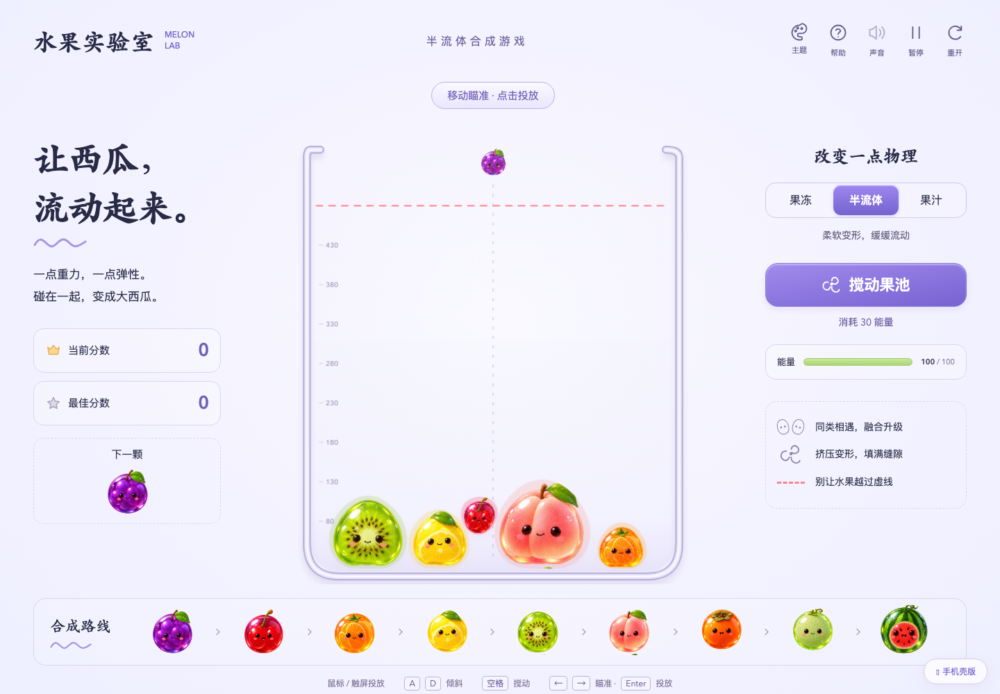
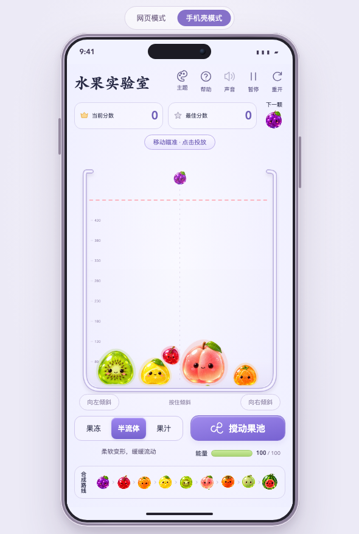

# FruitMerging · 水果实验室

提供 `dist/index.html` 网页版和 `dist/phone.html` 手机壳版。

## 体验地址

- [网页版](https://jdb156158.github.io/FruitMerging/)
- [手机壳版](https://jdb156158.github.io/FruitMerging/phone.html)

## 效果预览

### 网页版



### 手机壳版



## 技术实现

- **技术栈：**原生 HTML、CSS 和 JavaScript，不依赖前端框架或运行时依赖，可直接作为静态网站部署。
- **游戏渲染：**使用 Canvas 2D 绘制果池、水果、瞄准线、融合波纹、分数动画和危险线。
- **软体物理：**基于 Verlet 积分、边长约束、弯曲约束、面积压力和 SAT 碰撞检测，实现水果挤压、回弹、流动与融合。
- **物理模式：**果冻、半流体和果汁模式分别调整边缘刚度、弯曲强度、阻尼、压力和形状恢复参数。
- **交互支持：**兼容鼠标、触屏和键盘，支持瞄准投放、左右倾斜、搅动、暂停、重开和音效。
- **状态保存：**使用 `localStorage` 保存最佳分数和主题设置。
- **响应式适配：**CSS 媒体查询适配桌面、平板和手机；手机壳版通过响应式设备外框嵌入同一套游戏页面。
- **主题系统：**通过 CSS 自定义属性切换薰衣草、薄荷和蜜桃配色。
- **音效：**使用 Web Audio API 动态生成投放、融合和操作反馈音效。
- **测试与部署：**使用 Node.js 内置测试验证物理逻辑，通过 GitHub Actions 自动部署到 GitHub Pages。

## 本地运行

```sh
python3 -m http.server 5173 --directory dist
```

打开 http://localhost:5173/ 或 http://localhost:5173/phone.html 。

包含九级水果合成、软体变形、三种流动性、连融计分、最佳分数本地保存、下一颗预览、音效、暂停、重开、帮助、能量恢复、搅动、倾斜、超线三秒结束、西瓜达成与继续挑战。手机支持拖动瞄准、松手投放及按住倾斜。

参考及初始页面、物理实现和水果图集来自用户指定的 https://melon-game.jack-514.chatgpt.site/ 。本项目保留参考玩法，添加手机壳展示和响应式适配，移除原站基础设施注入脚本；运行时所有游戏资源均在本地，无需请求参考站。

## 验证

`node --test tests/physics.test.js` 验证合成、最高级消除、三模式稳定性和超线计时。已检查手机壳页面390×844布局及模式、能量、暂停/继续交互。
